# 6. Introducción a developer tools y setup del entorno de desarrollo
Un buen conjunto de herramientas hace que tu proceso de desarrollo sea más fluido.
Escoge las herramients que se ajusten a tus necesidades y usalas a tu favor.

## 6.1 Visual Studio Code

[Sitio Visual Studio Code](https://code.visualstudio.com/)

## Atajos de teclado

| Atajo | Descripción|
| --- | ---|
| ctrl + p | Abrir rápido|
| ctrl + shift + n | abrir una ventana|
| ctrl + w | cerrar una ventana |
| ctrl + x | cortar una línea|
| ctrl + c | copiar una línea|
| ctrl + g | ir a la línea|
| ctrl + f | buscar|
| ctrl + h | reemplazar|
| ctrl + n | nuevo archivo|
| ctrl + o | abrir archivo|
| ctrl + s | guardar|

## Plugin para el editor

* Auto Close Tag: Cierra un etiqueta HTML
* HTML Snippets: pequeñas plantillas de código
* JavaScript (ES6) code snippets: plantillas de código

## Instalación

1. Buscar en el navegador "vs code" y dar click al primer link
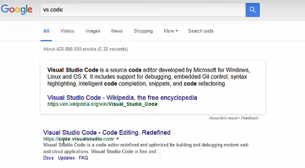

1. dar click en el botón de "descargar para Windows" (Mac o Linux)
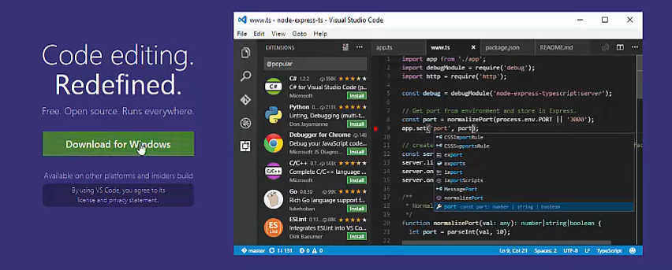

1. Guardar el instalador
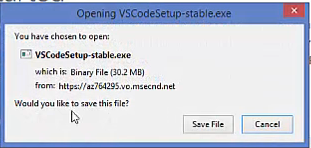

1. Ejecutar el instalador
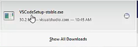

1. En el Setup wizard dar next > next > next >... dejando los valores por _default_
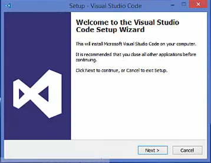

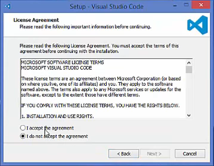

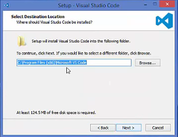

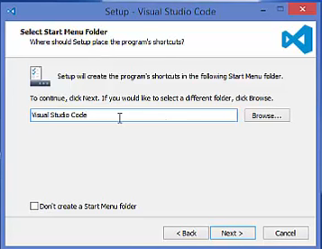

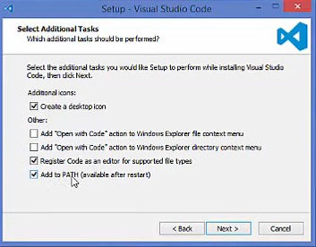

1. Dar click en el botón "Instalar"

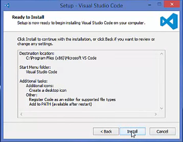
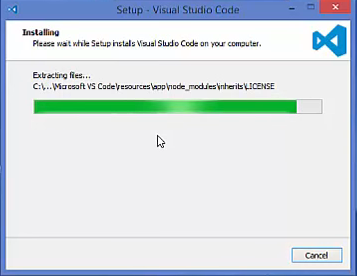

1. Dar clicl en el botón "Terminar"
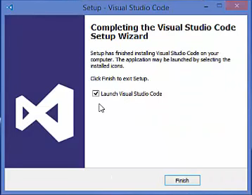

Debería abrirse el programa Visual Studio code

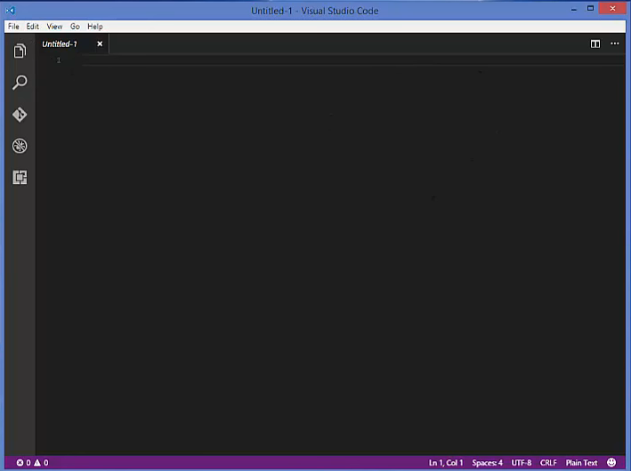

Para correr desde consola debes de teclar el comando "code"

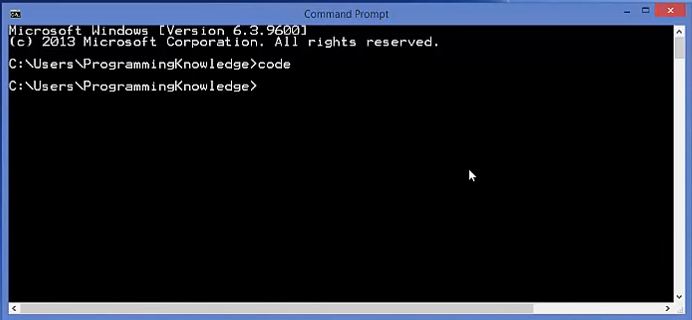
